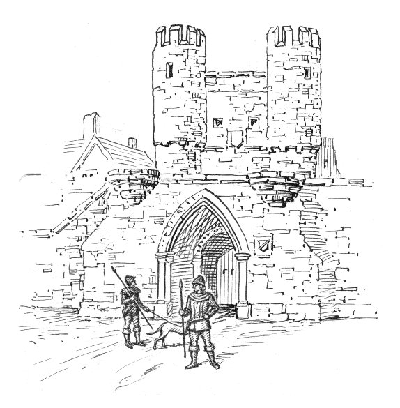

# Why Barbacana?

## What is a WAF?

Barbacana is a **Web Application Firewall**, or WAF. It is a small program that runs in front of your web app. It checks every HTTP request — the URL, the headers, the query string, the body — before your app sees it. If a request looks like an attack, Barbacana blocks it and returns an HTTP error. If the request looks safe, Barbacana sends it to your app and your code runs as usual.

For example, imagine your login form sends the username in the URL, and someone sends this request:

```
GET /login?user=admin'+OR+'1'='1
```

The piece `' OR '1'='1` is a well-known **SQL injection**. It tries to fool the database into returning every user instead of just one. Barbacana sees the pattern, blocks the request with a `403 Forbidden`, and writes a log line that explains why. Your app is never called, and the database never runs the bad query.

Of course, the same piece of text could also be a real input in some apps — for example, a search box on a site about logic or SQL itself. When a rule blocks a real, safe request like this, it is called a **false positive**. Barbacana lets you turn off rules that don't fit your app, or run them in detect-only mode so they only log instead of blocking. 

Barbacana comes with rules for hundreds of patterns like this one — not only SQL injection, but also cross-site scripting, command injection, path traversal, and many more. These rules are not invented from scratch: they come from the [OWASP Core Rule Set (CRS)](https://coreruleset.org/), the result of more than two decades of work by security researchers around the world. Barbacana uses these rules out of the box, so you just need to put it in front of your application and it hardens automatically.

## What Barbacana does

- **Blocks common web attacks for you.** SQL injection, cross-site scripting (XSS), code that tries to break into your shell, requests that try to read files outside your app's folder, and many more. → [Protection catalog](../reference/catalog.md)
- **Rejects strange requests.** Wrong HTTP method, body too big, file uploads of the wrong type. → [Accept rules](../reference/accept.md), [Uploads](../reference/uploads.md)
- **Adds modern security headers to responses.** Headers like `Content-Security-Policy` and `Strict-Transport-Security`, with no change to your app. → [Security headers](../reference/headers.md)
- **Gives you logs and metrics.** So you can see what was blocked and why, in the tools you already use. → [Logs & SIEM](../security/logs.md), [Metrics](../operations/metrics.md)
- **Lets you adjust the rules to fit your app.** If a rule blocks a real, safe request by mistake (a *false positive*), you can turn that rule off, or run it in [detect-only mode](../reference/detect-only.md) so it only writes a log and does not block. If you want stronger protection, you can also turn on extra rules that are off by default. Good defaults, easy to adjust, no code changes. → [Disable protections](../reference/disable.md)
- **Checks requests against your API spec.** Barbacana can also reject requests that don't match your API. If you publish an [OpenAPI](https://www.openapis.org/) spec — which paths exist, which methods they accept, what the body should look like — Barbacana reads it and uses it as a strict allow-list. A request to an unknown path, or with the wrong content type, is blocked before it reaches your app. → [OpenAPI conformance](../reference/openapi.md)

## What Barbacana does *NOT* do

A WAF is one part of your defense, not all of it. Barbacana, by design, does **not**:

- **Log users in for you.** Your app is still in charge of who the user is and what they can do. A WAF cannot tell if *this* logged-in user is allowed to read *that* document.
- **Fix bugs in your dependencies.** If a library you use has a known security bug, Barbacana can sometimes block the attack pattern, but you still need to update the library.
- **Catch bugs in your business logic.** Problems like "user A can see user B's invoices" are specific to your app. A general firewall has no way to know that this is wrong — only your code does.
- **Stop floods of traffic.** If someone sends millions of requests to take your site down (a DDoS attack), you need a CDN or an anti-DDoS service in front. A WAF checks each request one by one — it does not absorb large traffic floods.
- **Block or allow by IP address.** Barbacana has no IP allow-list or deny-list, on purpose. Attackers can change IP easily with VPNs, so blocking by IP rarely works — and an IP allow-list breaks every time a real user's IP changes, which happens often. IP filtering belongs in your network firewall or your CDN, not here.
- **Read traffic it cannot decrypt.** If HTTPS is decrypted *after* Barbacana, all Barbacana sees is encrypted data, which it cannot check. HTTPS must end at Barbacana, or before it, so the WAF can do its job.

## Where the name comes from

*Barbacana* is the Spanish word for **[barbican](https://en.wikipedia.org/wiki/Barbican)** — the small fortified entrance you sometimes see in front of medieval castles. Before attackers could reach the main wall, they had to pass through this narrow outer gate, where the defenders could watch them. It was the castle's first filter.

This is exactly the role of a WAF: an outer gate that filters traffic before it reaches the app behind it.

{ loading=lazy }

<small>Image: *Barbican (PSF)*, via [Wikimedia Commons](https://commons.wikimedia.org/wiki/File:Barbican_(PSF).jpg) — see also the Spanish Wikipedia entry [*Barbacana*](https://es.wikipedia.org/wiki/Barbacana).</small>

## Further reading

Good places to learn more:

- [Web application firewall — Wikipedia](https://en.wikipedia.org/wiki/Web_application_firewall)
- [OWASP — Web Application Firewall](https://owasp.org/www-community/Web_Application_Firewall)
- [OWASP Top Ten](https://owasp.org/www-project-top-ten/) — the most common web attacks, the ones a WAF is built to stop

## Next steps

- [Quickstart](quickstart.md) — protect an app in three lines of YAML.
- [Installation](installation.md) — Docker, Compose, Kubernetes, systemd.
- [Security overview](../security/overview.md) — what Barbacana defends against, in more depth.
