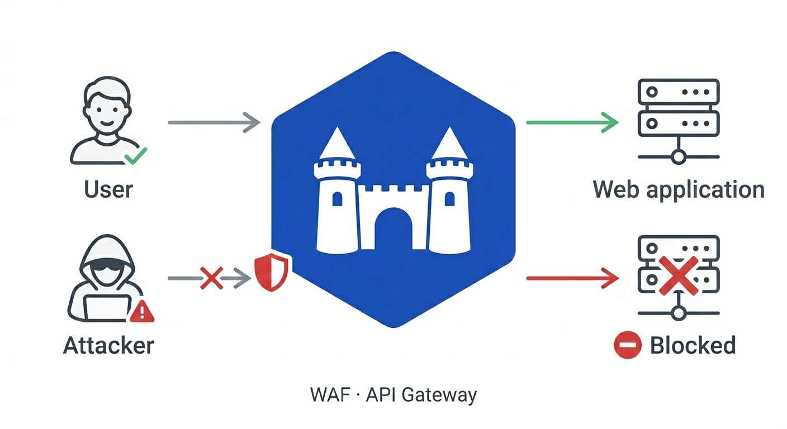

---
hide:
  - navigation
  - toc
---

# Barbacana

**Secure by default. Simple by design.**

[](LICENSE)
[](https://github.com/barbacana-waf/barbacana/releases)

Barbacana is an open-source WAF and API security gateway. It sits between the internet and your application, inspects every HTTP request for known attack patterns — SQL injection, XSS, command injection, path traversal, and hundreds more — and blocks malicious requests before they reach your server.



## Quickstart

```yaml title="waf.yaml"
version: v1alpha1

routes:
  - upstream: http://your-app:8000
```

```bash
docker run --rm -p 8080:8080 \
  -v $(pwd)/waf.yaml:/etc/barbacana/waf.yaml:ro \
  ghcr.io/barbacana-waf/barbacana:latest
```

Every protection is on by default. [Full quickstart →](getting-started/quickstart.md)

And that minimalistic configuration works. Out of the box, with no extra tuning, Barbacana v0.5.0 scored **93.65%** on [GoTestWAF](https://github.com/wallarm/gotestwaf), an open-source WAF benchmark: it blocked 84% of attacks while allowing 91% of normal traffic, a strong balance between security and false positives. It also passes **99.75%** of [go-ftw](https://github.com/coreruleset/go-ftw), the official test suite from the OWASP CRS authors.

Sizing your deployment? 1 vCPU and ~130 MB of memory handles ~125 requests per second, with p99 latency under 40 ms for typical traffic. [Full benchmark details →](blog/posts/v060-performance-benchmark.md)

## Beyond the defaults

The defaults cover the happy path. When you need to tune a noisy route, terminate TLS, or roll out a new endpoint without blocking traffic — the config stays just as small.

<div class="feature-row" markdown>
<div class="feature-text" markdown>
:material-shield-check:{ .feature-icon }

### 182 protections on by default, 30 more opt-in

182 protections activate the moment you start Barbacana — no config required. A further 30 are available as opt-in: aggressive detection variants that need per-app tuning. For example, `sql-injection-comments-in-json` detects MySQL space-obfuscation, but can block ordinary JSON when active. The [protection catalog](reference/catalog.md) details each protection, why they should be on or off, and how to tune them.
</div>
<div class="feature-code" markdown>
```yaml
routes:
  - upstream: http://app:8000
    enable:
      - sql-injection-comments-in-json  
```
</div>
</div>

<div class="feature-row" markdown>
<div class="feature-text" markdown>
:material-tune-variant:{ .feature-icon }

### Tune by name, not by rule ID

Protections have human-readable names. For example, the protection `sql-injection-union-select` detects UNION SELECT and ALTER TABLE patterns — instead of `SecRuleRemoveById 942270`. The code disables that protection in the `/search` route, where users can legitimately submit SQL snippets as part of their queries.
</div>
<div class="feature-code" markdown>
```yaml
routes:
  - match:
      paths: ["/search"]
    upstream: http://search:8000
    disable:
      - sql-injection-union-select
```
</div>
</div>

<div class="feature-row" markdown>
<div class="feature-text" markdown>
:material-shield-search:{ .feature-icon }

### Ship safely with detect-only

Roll out a new route in observe mode first. Every request is inspected and logged, but matches are forwarded instead of blocked — review the OCSF or ECS [audit log](operations/audit-log.md), then flip the switch.
</div>
<div class="feature-code" markdown>
```yaml
routes:
  - upstream: http://api:8000
    detect_only: true
```
</div>
</div>

<div class="feature-row" markdown>
<div class="feature-text" markdown>
:material-graph-outline:{ .feature-icon }

### Distributed traces

Ship W3C trace context to any OTLP collector — Jaeger, Tempo, or your vendor backend. Barbacana propagates `traceparent` to your server, so a single [distributed trace](operations/tracing.md) continues from client, through the WAF, into your application.
</div>
<div class="feature-code" markdown>
```yaml
tracing:
  enabled: true
  endpoint: otel-collector:4317
```
</div>
</div>

<div class="feature-row" markdown>
<div class="feature-text" markdown>
:material-filter-check:{ .feature-icon }

### Accept only what the route expects

Declare the allowed methods and content types per route. Requests outside that envelope get a 405 or 415 before WAF rules even run.
</div>
<div class="feature-code" markdown>
```yaml
routes:
  - match:
      paths: ["/api/*"]
    upstream: http://api:8000
    accept:
      content_types: [application/json]
      methods: [GET, POST]
```
</div>
</div>

<div class="feature-row" markdown>
<div class="feature-text" markdown>
:material-lock-check:{ .feature-icon }

### HTTPS, no certificates to manage

Add a hostname. Barbacana provisions and renews Let's Encrypt certificates automatically, redirects `:80` to `:443`, and uses a local CA for `.localhost` development.
</div>
<div class="feature-code" markdown>
```yaml
version: v1alpha1
host: api.example.com
data_dir: /data/barbacana
routes:
  - upstream: http://app:8080
```
</div>
</div>

<div class="feature-row" markdown>
<div class="feature-text" markdown>
:material-file-document-check:{ .feature-icon }

### Validate requests against your OpenAPI spec

Mount a spec and Barbacana enforces it at the gateway — unknown paths, wrong methods, and malformed bodies are rejected before they reach your server.
</div>
<div class="feature-code" markdown>
```yaml
routes:
  - match:
      paths: ["/api/*"]
    upstream: http://api:8000
    openapi:
      spec: /specs/api.yaml
```
</div>
</div>

<div class="feature-row" markdown>
<div class="feature-text" markdown>
:material-upload:{ .feature-icon }

### Safe file upload endpoints

Constrain upload routes by file count, size, and MIME type. Barbacana inspects multipart requests and rejects oversized or unexpected file types before they reach your server.
</div>
<div class="feature-code" markdown>
```yaml
routes:
  - match:
      paths: ["/upload/*"]
    upstream: http://uploads:8000
    accept:
      content_types: [multipart/form-data]
    multipart:
      file_limit: 20
      file_size: 2MB
      allowed_types: [image/png, image/jpeg, application/pdf]
```
</div>
</div>

<p class="trust-strip" markdown>
:material-package-variant-closed: Single image &middot;
:material-format-list-checks: 500+ OWASP CRS rules &middot;
:material-license: Apache 2.0
</p>

<div class="cta-row" markdown>
[:material-rocket-launch: &nbsp; **Full quickstart**](getting-started/quickstart.md){ .md-button .md-button--primary }
[:material-format-list-checks: &nbsp; **Protection catalog**](reference/catalog.md){ .md-button }
[:material-shield-half-full: &nbsp; **Security model**](security/overview.md){ .md-button }
</div>

## Built on

Barbacana wraps [Caddy](https://caddyserver.com) (HTTP, TLS, reverse proxy), [Coraza](https://coraza.io) (WAF engine), and the [OWASP CRS v4](https://coreruleset.org) (detection rules) — two decades of work by the security community made this project possible. Thanks to their maintainers and contributors.

Barbacana also runs `ghcr.io/barbacana-waf/barbacana` as the main image registry, with an identical mirror at `docker.io/barbacana/barbacana`.
