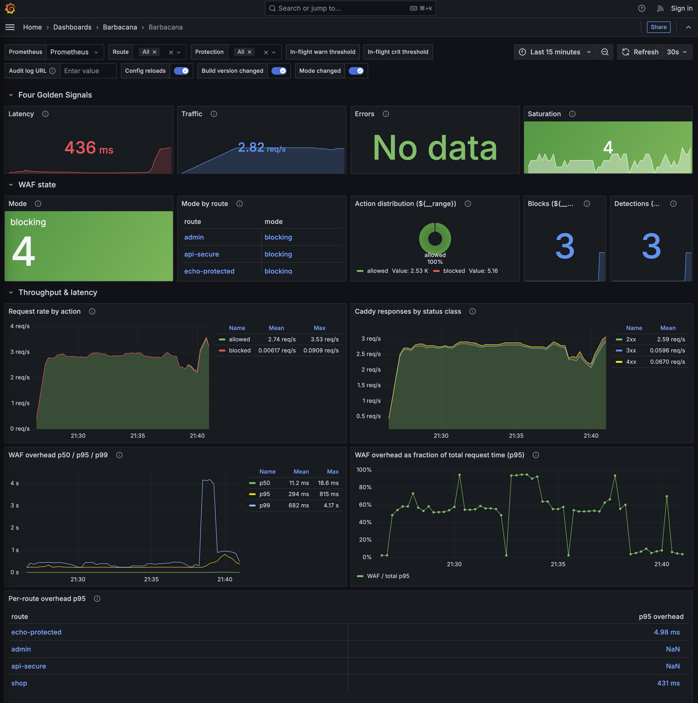

# Grafana dashboard

!!! warning "Prerequisite: Prometheus scrape"
    Set `metrics_port` in your config to a non-zero value so Barbacana opens its `/metrics` listener, and point Prometheus at it. With the default `metrics_port: 0`, no metrics endpoint exists and the dashboard panels stay empty.

Barbacana ships a single Grafana dashboard organised around the Site Reliability Engineering (SRE) Four Golden Signals — Latency, Traffic, Errors, Saturation. One JSON, one import, one URL to bookmark. This is a starting point; modify it as needed.

## Importing into Grafana

1. Download [`barbacana.json`](../assets/barbacana.json) from the docs assets.

2. In Grafana, open *Dashboards* → *New* → *Import*. Upload the file (or paste the JSON), pick your Prometheus data source when prompted, and save.
